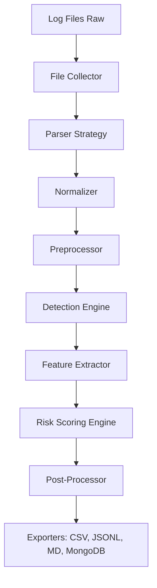

# Web Log Analyzer & Threat Detection System

[](https://www.python.org/)
[](https://opensource.org/licenses/MIT)

Hệ thống phân tích log máy chủ web và phát hiện tấn công dựa trên luật (rule-based). Dự án này cung cấp một pipeline xử lý dữ liệu hoàn chỉnh từ khâu thu thập log thô đến khi xuất báo cáo chi tiết về các hành vi xâm nhập tiềm ẩn.

---

## 1. TỔNG QUAN DỰ ÁN

*   **Mục tiêu chính**: Tự động hóa quá trình phân tích nhật ký (logs) từ các máy chủ web phổ biến (Apache, Nginx, IIS) để phát hiện các mẫu tấn công như SQL Injection, XSS, Path Traversal, và các hành vi bất thường khác.
*   **Loại hình dự án**: Công cụ CLI (Command Line Interface) & Pipeline xử lý dữ liệu.
*   **Điểm nổi bật**: 
    *   Không phụ thuộc vào các mô hình Machine Learning nặng nề (giảm độ trễ, dễ giải thích).
    *   Hỗ trợ đa dạng định dạng log với kiến trúc linh hoạt.
    *   Quy trình chuẩn hóa dữ liệu chặt chẽ giúp phân tích chính xác hơn.

---

## 2. CÔNG NGHỆ & THƯ VIỆN CỐT LÕI

*   **Ngôn ngữ chính**: Python 3.8+
*   **Thư viện quan trọng**:
    *   `PyYAML`: Quản lý và thực thi các bộ luật phát hiện tấn công định nghĩa trong file YAML.
    *   `python-dateutil`: Xử lý linh hoạt các định dạng thời gian khác nhau từ log máy chủ.
    *   `chardet` (sử dụng trong Collector): Tự động phát hiện bảng mã (encoding) của file log.
    *   `pytest`: Hệ thống kiểm thử đơn vị và kiểm thử tích hợp.
    *   `pymongo`: Hỗ trợ lưu trữ kết quả phân tích vào MongoDB.

---

## 3. KIẾN TRÚC & NGUYÊN LÝ HOẠT ĐỘNG

Dự án được thiết kế theo mô hình **Pipeline** tuần tự, đảm bảo tính đóng gói và dễ dàng mở rộng từng module.

### Luồng vận hành chính (Execution Flow)



1.  **Collector**: Đọc file, xử lý lỗi encoding, gộp các dòng log bị ngắt quãng.
2.  **Parser**: Sử dụng Regex để bóc tách các trường thông tin (IP, Method, URL, Status Code...).
3.  **Normalizer**: Chuyển đổi dữ liệu về một schema chung duy nhất cho tất cả các loại server.
4.  **Preprocessor**: Giải mã URL (URL Decoding), chuẩn hóa chuỗi yêu cầu để tránh các kỹ thuật lẩn tránh (obfuscation).
5.  **Detection & Features**: 
    *   `Detection`: Đối khớp dữ liệu với các luật trong `attack_patterns.yaml`.
    *   `Features`: Trích xuất các thuộc tính thống kê (độ hỗn luận entropy, độ dài, từ khóa nguy hiểm).
6.  **Scoring**: Tính toán điểm rủi ro và phân loại cấp độ cảnh báo (Low, Medium, High, Critical).
7.  **Reporting**: Tổng hợp dữ liệu và xuất báo cáo dưới dạng Markdown và tệp dữ liệu cấu trúc.

---

## 4. CẤU TRÚC THƯ MỤC

```text
├── data/
│   ├── rules/              # Chứa attack_patterns.yaml (Core Rules)
│   └── raw/                # Dữ liệu log đầu vào mẫu (Apache, Nginx, IIS)
├── src/
│   ├── collector/          # Logic thu thập và xử lý file thô
│   ├── parser/             # Bộ phân tách log (Factory & Strategy Pattern)
│   ├── normalizer/         # Chuẩn hóa dữ liệu sang Schema chung
│   ├── preprocessor/       # Tiền xử lý request (URL decode, v.v.)
│   ├── detection/          # Engine kiểm tra luật (Rule Matching)
│   ├── features/           # Trích xuất đặc trưng thống kê
│   ├── scoring/            # Công cụ tính toán điểm rủi ro (Risk Engine)
│   ├── exporters/          # Xuất dữ liệu ra CSV, JSONL, MongoDB
│   ├── reporting/          # Tạo báo cáo tổng hợp & Markdown
│   └── main.py             # Orchestrator (Điều phối toàn bộ Pipeline)
├── tests/                  # Hệ thống kiểm thử cho từng module
└── main.py                 # Entry point của ứng dụng
```

---

## 5. HƯỚNG DẪN CÀI ĐẶT & CHẠY THỬ

### Điều kiện tiên quyết
*   Python 3.8 trở lên.
*   Cài đặt `conda` (khuyên dùng) hoặc `pip`.

### Thiết lập môi trường
```bash
# Sử dụng Conda
conda env create -f environment.yml
conda activate vdt

# Hoặc sử dụng Pip
pip install -r requirements.txt
```

### Lệnh thực thi chính
Chạy phân tích một file log cụ thể:
```bash
python -m src.main --input data/raw/apache/access.log --server-type apache --output-dir outputs/my_run
```

**Các tham số chính:**
*   `--input`: Đường dẫn tới file log cần phân tích.
*   `--server-type`: Loại máy chủ (`apache`, `nginx`, `iis`).
*   `--output-dir`: Thư mục chứa kết quả đầu ra.
*   `--rules`: (Tùy chọn) Đường dẫn tới file luật YAML tùy chỉnh.

### Chuyển đổi định dạng đầu vào (Optional)
Để chuyển đổi các định dạng `.txt`, `.csv`, `.json` sang JSONL chuẩn cho pipeline:
```bash
python convert.py --input <input_file>
```

---

## 6. KIỂM THỬ (TESTS)

Chạy toàn bộ tests:
```bash
pytest -q
```

Chạy test không tạo bytecode:
```bash
PYTHONDONTWRITEBYTECODE=1 pytest -q -p no:cacheprovider
```

---

## 7. CÁC QUYẾT ĐỊNH THIẾT KẾ ĐẶC BIỆT

1.  **Strategy & Factory Pattern**: Được áp dụng trong module `parser`. Hệ thống tự động chọn bộ Parser phù hợp dựa trên tham số `server_type`, cho phép dễ dàng thêm các loại máy chủ mới mà không ảnh hưởng đến luồng chính.
2.  **Schema Unification**: Tất cả dữ liệu sau khi parse được đưa về một cấu trúc (Normalizer) đồng nhất. Điều này cho phép `Detection Engine` và `Risk Engine` hoạt động độc lập với nguồn log ban đầu.
3.  **Deterministic Scoring**: Thay vì sử dụng xác suất đen (black-box), điểm rủi ro được tính toán dựa trên trọng số rõ ràng từ các luật vi phạm và các đặc trưng trích xuất được, giúp chuyên gia bảo mật dễ dàng truy vết lý do cảnh báo.
4.  **Error Resilience**: Module `Collector` có khả năng tự phục hồi khi gặp file log bị hỏng hoặc lỗi encoding, đảm bảo pipeline không bị ngắt quãng giữa chừng.
